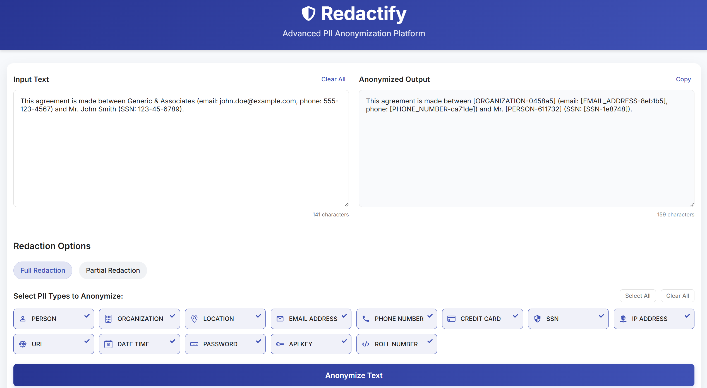

# Redactify - Advanced PII Anonymization Platform


Redactify is a comprehensive solution for detecting and anonymizing personally identifiable information (PII) in text documents. The application combines a modern React frontend with a powerful Python Flask backend to provide an intuitive and effective PII redaction service.



### PS : Still figuring out a way to host server for free. (There are some memory constraints on service providers like render)

## 🔍 Overview

Redactify helps organizations comply with data privacy regulations by identifying and removing sensitive information from text. The platform uses a sophisticated multi-method detection approach combining machine learning models, rule-based patterns, and Microsoft's Presidio Analyzer to achieve high accuracy PII detection.

### Project Architecture

```
redactify/
├── client/          # React frontend application
│   ├── public/
│   ├── src/
│   ├── .env
│   └── package.json
│
├── server/          # Flask backend API
│   ├── anonymizers/ # PII detection and anonymization logic
│   ├── server.py    # Main API entry point
│   └── requirements.txt
│
└── README.md        # This file
```

## ✨ Key Features

### Detection Capabilities
- **Multi-Method Detection**: Combines machine learning (Hugging Face NER), rule-based patterns (regex), and Presidio Analyzer
- **13+ PII Types**: Identifies personal names, organizations, locations, email addresses, phone numbers, credit cards, SSNs, IP addresses, URLs, dates, passwords, API keys, and roll numbers
- **Customizable Confidence Thresholds**: Configure detection sensitivity based on your needs

### Anonymization Options
- **Full Redaction**: Replace PII with categorized placeholders (e.g., `[PERSON-611732]`)
- **Partial Redaction**: Preserve some characters while masking others for better context retention
- **Selective Anonymization**: Enable/disable specific PII types for targeted redaction

### User Experience
- **Intuitive Interface**: Clean, responsive design works across devices
- **Real-time Feedback**: Toast notifications provide operation status
- **Animated UI**: Smooth transitions make interaction pleasant
- **Performance Optimizations**: Concurrent processing for faster results

## 🛠 Technologies Used

### Frontend (Client)
- React 18.2.0
- Framer Motion (animations)
- React Icons
- SweetAlert2 (notifications)
- CSS3 with custom styling

### Backend (Server) 
- Python 3.9+
- Flask web framework
- Microsoft Presidio Analyzer
- Hugging Face Transformers (BERT NER model)
- Regular expressions for pattern matching
- Thread pool for concurrent processing

## 🚀 Installation & Setup

### Prerequisites
- Node.js (v16+)
- Python (v3.9+)
- npm or yarn
- pip

### Clone the Repository

```bash
git clone https://github.com/rushilpatel21/Redactify.git
cd Redactify
```

### Backend Setup

```bash
# Navigate to server directory
cd server

# Create and activate a virtual environment
python -m venv venv
source venv/bin/activate   # On Windows, use `venv\Scripts\activate`

# Install dependencies
pip install -r requirements.txt

# Run the server
python server.py   # Runs on http://localhost:8000 by default
```

### Frontend Setup

```bash
# Navigate to client directory
cd client

# Install dependencies
npm install

# Create .env file
echo "VITE_BACKEND_BASE_URL='http://localhost:8000'" > .env

# Start development server
npm run dev   # Access at http://localhost:5173 by default
```

## 🔧 Environment Configuration

### Backend
The server uses environment variables for configuration:
- `PORT`: Server port (default: 8000)
- `CONFIDENCE_THRESHOLD`: Detection confidence threshold (default: 0.6)

### Frontend
The client uses a `.env` file for configuration:
- `VITE_BACKEND_BASE_URL`: Backend API URL (default: 'http://localhost:8000')

## 📝 API Documentation

### Anonymize Endpoint

```
POST /anonymize
```

#### Request Format

```json
{
  "text": "The input text containing PII to anonymize",
  "options": {
    "PERSON": true,
    "ORGANIZATION": true,
    "LOCATION": true,
    "EMAIL_ADDRESS": true,
    "PHONE_NUMBER": true,
    "CREDIT_CARD": true,
    "SSN": true,
    "IP_ADDRESS": true,
    "URL": true,
    "DATE_TIME": true,
    "PASSWORD": true,
    "API_KEY": true,
    "ROLL_NUMBER": true
  },
  "full_redaction": true
}
```

#### Response Format

Success:
```json
{
  "anonymized_text": "The redacted text with PII anonymized"
}
```

Error:
```json
{
  "error": "Description of the error that occurred"
}
```

## 📋 Usage Examples

### Example 1: Full Redaction

**Input:**
```
This agreement is made between Generic & Associates (email: john.doe@example.com, phone: 555-123-4567) and Mr. John Smith (SSN: 123-45-6789).
```

**Output:**
```
This agreement is made between [ORGANIZATION-0458a5] (email: [EMAIL_ADDRESS-8eb1b5], phone: [PHONE_NUMBER-ca71de]) and Mr. [PERSON-611732] (SSN: [SSN-1e8748]).
```

### Example 2: Partial Redaction

**Input:**
```
Please contact John Smith at john.smith@example.com or 555-123-4567.
```

**Output:**
```
Please contact Jo*****ith at jo****ith@*******.com or 55*******567.
```

---

&copy; 2025 Redactify. All rights reserved.
