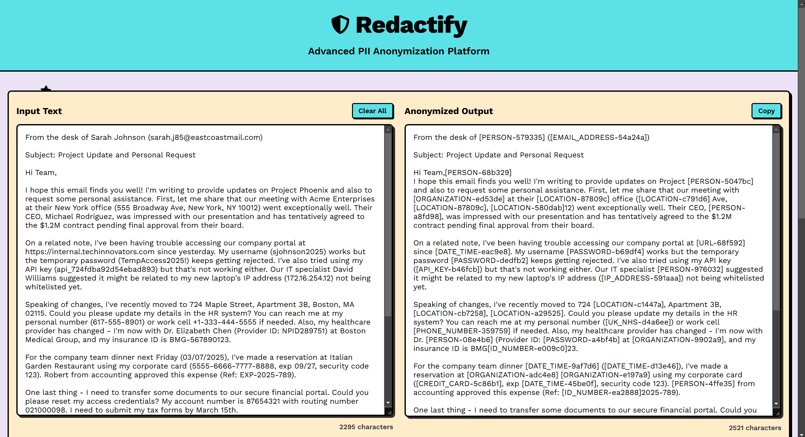
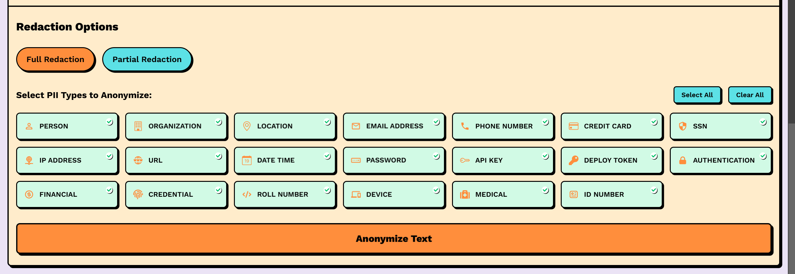
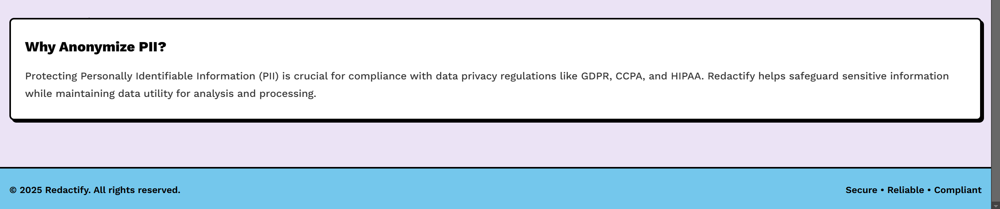
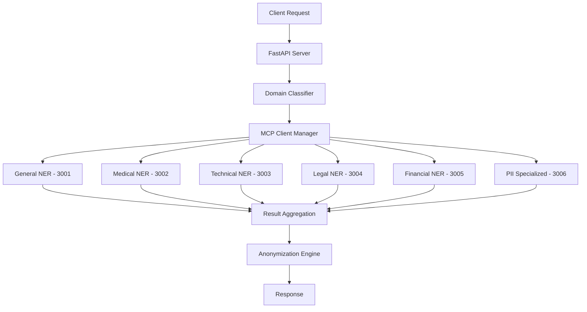

# Redactify - Advanced PII Anonymization Platform


Redactify is a next-generation PII anonymization platform built on a sophisticated **Model Context Protocol (MCP)** microservices architecture. The application combines a modern React frontend with a distributed FastAPI backend ecosystem, featuring specialized domain-specific NER models for unparalleled accuracy in PII detection and anonymization.





## 🔍 Overview

Redactify helps organizations comply with data privacy regulations through advanced PII detection and anonymization. The platform leverages a **distributed MCP (Model Context Protocol) architecture** with specialized domain-specific NER models, combining machine learning, rule-based patterns, and Microsoft's Presidio Analyzer for industry-leading accuracy.

### 🏗️ MCP Architecture

The system operates as a distributed microservices ecosystem where each domain-specific NER model runs as an independent MCP server:

```
redactify/
├── client/                    # React 19 frontend with Vite
│   ├── src/                   # React components & logic
│   ├── public/                # Static assets
│   ├── package.json           # Dependencies (Framer Motion, React Icons)
│   └── vite.config.js         # Build configuration
│
├── server/                    # FastAPI backend ecosystem
│   ├── server.py              # Main FastAPI application & MCP orchestrator
│   ├── auto_mcp_manager.py    # Automatic MCP server lifecycle management
│   ├── mcp_client.py          # MCP client connections & communication
│   ├── detection_engine.py    # Multi-method detection pipeline
│   ├── anonymization_engine.py # Text anonymization & pseudonymization
│   ├── model_manager.py       # ML model loading & caching
│   │
│   ├── a2a_ner_general/       # General-purpose NER MCP server (port 3001)
│   ├── a2a_ner_medical/       # Medical domain NER MCP server (port 3002)
│   ├── a2a_ner_technical/     # Technical domain NER MCP server (port 3003)
│   ├── a2a_ner_legal/         # Legal domain NER MCP server (port 3004)
│   ├── a2a_ner_financial/     # Financial domain NER MCP server (port 3005)
│   ├── a2a_ner_pii_specialized/ # PII-specialized NER MCP server (port 3006)
│   ├── mcp_classifier/        # Text classification for domain routing
│   │
│   ├── mcp_config.json        # MCP system configuration
│   ├── requirements.txt       # Python dependencies
│   └── *.json                 # Detection patterns & configurations
│
├── fine-tuned-model/          # ML model training & fine-tuning
└── assets/                    # Project screenshots & documentation
```

### 🔄 MCP Workflow

1. **Auto-Startup**: `AutoMCPManager` automatically starts all domain-specific NER servers
2. **Domain Classification**: Text is analyzed to determine relevant domains (medical, legal, etc.)
3. **Distributed Detection**: Relevant MCP servers process text in parallel via JSON-RPC
4. **Result Aggregation**: Detection engine combines results from multiple specialized models
5. **Anonymization**: Anonymization engine applies pseudonymization or masking strategies

## ✨ Key Features

### 🎯 Detection Capabilities
- **MCP Distributed Architecture**: 6 specialized domain-specific NER models running as independent microservices
- **Multi-Method Detection**: Combines Hugging Face Transformers, Microsoft Presidio, regex patterns, and contextual analysis
- **20+ PII Types**: Comprehensive detection including names, organizations, locations, emails, phones, credit cards, SSNs, IP addresses, URLs, dates, passwords, API keys, roll numbers, and domain-specific entities
- **Domain-Specific Models**: Specialized detection for medical, legal, financial, and technical contexts
- **Adaptive Confidence Thresholds**: Configurable sensitivity per domain and entity type
- **Contextual Analysis**: 40-character context windows for improved accuracy

### 🔒 Anonymization Strategies
- **Pseudonymization**: Replace PII with consistent hash-based placeholders (e.g., `[PERSON-611732]`)
- **Masking**: Partial character replacement preserving format (e.g., `Jo****th`)
- **Full Redaction**: Complete removal with category labels
- **Custom Strategies**: Configurable anonymization rules per entity type
- **Format Preservation**: Maintain document structure and readability
- **Selective Processing**: Granular control over which PII types to anonymize

### 🚀 Performance & Scalability
- **Concurrent Processing**: Parallel execution across MCP servers
- **Model Caching**: Intelligent model loading and memory management
- **Batch Processing**: Efficient handling of multiple documents
- **Health Monitoring**: Automatic MCP server health checks and recovery
- **Load Balancing**: Distributed processing across specialized models
- **Memory Optimization**: Configurable model memory limits (4GB default)

## 🛠 Technology Stack

### Frontend (Client)
- **Framework**: React 19.0.0 with Vite 6.1.0 build system
- **Language**: JavaScript (ES modules)
- **UI Libraries**: 
  - Framer Motion 12.4.7 (smooth animations)
  - React Icons 5.5.0 (comprehensive iconography)
  - SweetAlert2 11.17.2 (elegant notifications)
- **Development**: ESLint for code quality, SWC for fast compilation
- **Build Tool**: Vite with hot module replacement

### Backend (Server) - MCP Architecture
- **Framework**: FastAPI 0.95.0+ with Python 3.9+
- **Server**: Uvicorn ASGI server for high-performance async handling
- **MCP Protocol**: Model Context Protocol 0.3.0+ for distributed microservices
- **PII Detection Stack**:
  - Microsoft Presidio Analyzer/Anonymizer 2.2.33+
  - Hugging Face Transformers 4.28.1+ (BERT-based NER models)
  - PyTorch 2.0.0+ for ML inference
  - OpenAI 1.0.0+ for LLM-enhanced detection
- **Specialized NER Models**: 6 domain-specific models (medical, legal, financial, technical, general, PII-specialized)
- **Infrastructure**: 
  - Automatic MCP server lifecycle management
  - JSON-RPC communication between services
  - Health monitoring and auto-recovery
  - Concurrent processing with thread pools
- **Utilities**: python-dotenv, requests, pydantic, psutil

## 🚀 Installation & Setup

### Prerequisites
- Node.js (v16+)
- Python (v3.9+)
- npm or yarn
- pip

### Clone the Repository

```bash
git clone https://github.com/rushilpatel21/Redactify.git
cd Redactify
```

### Backend Setup (MCP Architecture)

```bash
# Navigate to server directory
cd server

# Create and activate a virtual environment
python -m venv venv
source venv/bin/activate   # On Windows, use `venv\Scripts\activate`

# Install dependencies
pip install -r requirements.txt

# Configure environment (optional)
cp .env.example .env
# Edit .env to set PORT, CONFIDENCE_THRESHOLD, MAX_WORKERS, etc.

# Run the server (automatically starts all MCP servers)
python server.py   # Main server on http://localhost:8000
                   # MCP servers auto-start on ports 3001-3006
```

The server will automatically:
- Start 6 specialized MCP NER servers (ports 3001-3006)
- Initialize MCP client connections
- Begin health monitoring of all services
- Load and cache ML models as needed

### Frontend Setup

```bash
# Navigate to client directory
cd client

# Install dependencies
npm install

# Create .env file
echo "VITE_BACKEND_BASE_URL='http://localhost:8000'" > .env

# Start development server
npm run dev   # Access at http://localhost:5173 by default
```

## 🔧 Environment Configuration

### Backend (.env)
```bash
# Server Configuration
PORT=8000
DEBUG=False
ENVIRONMENT=production
FRONT_END_URL=http://localhost:5173

# MCP Configuration
MAX_WORKERS=8
MAX_MODEL_MEMORY_MB=4096
CONFIDENCE_THRESHOLD=0.5

# Model Configuration
ENABLE_PRESIDIO=true
ENABLE_REGEX=true
ENABLE_CONTEXTUAL=true
CONTEXT_WINDOW=40

# Domain-Specific Models
ENABLE_MEDICAL_PII=true
ENABLE_TECHNICAL_NER=true
ENABLE_LEGAL_NER=true
ENABLE_FINANCIAL_NER=true
ENABLE_PII_SPECIALIZED=true

# MCP Server Ports (auto-configured)
A2A_GENERAL_PORT=3001
A2A_MEDICAL_PORT=3002
A2A_TECHNICAL_PORT=3003
A2A_LEGAL_PORT=3004
A2A_FINANCIAL_PORT=3005
A2A_PII_SPECIALIZED_PORT=3006

# Optional: Enhanced Detection
GEMINI_API_KEY=your_gemini_api_key_here
```

### Frontend (.env)
```bash
VITE_BACKEND_BASE_URL=http://localhost:8000
```

## 📝 API Documentation

### Core Endpoints

#### 1. Single Text Anonymization
```
POST /anonymize
```

**Request:**
```json
{
  "text": "The input text containing PII to anonymize",
  "options": {
    "PERSON": true,
    "ORGANIZATION": true,
    "LOCATION": true,
    "EMAIL_ADDRESS": true,
    "PHONE_NUMBER": true,
    "CREDIT_CARD": true,
    "SSN": true,
    "IP_ADDRESS": true,
    "URL": true,
    "DATE_TIME": true,
    "PASSWORD": true,
    "API_KEY": true,
    "ROLL_NUMBER": true
  },
  "full_redaction": true
}
```

**Response:**
```json
{
  "anonymized_text": "The redacted text with PII anonymized",
  "entities": [...],
  "processing_time": 0.45,
  "domains_detected": ["general", "medical"],
  "entities_processed": 5,
  "strategy_used": "pseudonymize",
  "metadata": {
    "total_entities": 5,
    "domains_used": ["general", "medical"],
    "detectors_used": ["presidio", "huggingface", "regex"]
  }
}
```

#### 2. Batch Processing
```
POST /anonymize_batch
```

**Request:**
```json
{
  "texts": ["Text 1 with PII", "Text 2 with PII"],
  "options": { ... },
  "full_redaction": true
}
```

#### 3. Entity Detection Only
```
POST /detect
```

#### 4. System Monitoring
```
GET /health          # Overall system health
GET /mcp-status      # Detailed MCP server status
GET /config          # System configuration
```

## 🏥 MCP Server Specializations

### Domain-Specific NER Models

| Server | Port | Specialization | Key Entities |
|--------|------|----------------|--------------|
| **General** | 3001 | General-purpose PII | Names, emails, phones, addresses |
| **Medical** | 3002 | Healthcare data | Patient IDs, medical records, HIPAA entities |
| **Technical** | 3003 | Technical documentation | API keys, server names, technical identifiers |
| **Legal** | 3004 | Legal documents | Case numbers, legal entities, court references |
| **Financial** | 3005 | Financial data | Account numbers, routing numbers, financial IDs |
| **PII Specialized** | 3006 | Advanced PII detection | Complex personal identifiers, custom patterns |

### MCP Communication Flow



## 📋 Usage Examples

### Example 1: Full Redaction

**Input:**
```
This agreement is made between Generic & Associates (email: john.doe@example.com, phone: 555-123-4567) and Mr. John Smith (SSN: 123-45-6789).
```

**Output:**
```
This agreement is made between [ORGANIZATION-0458a5] (email: [EMAIL_ADDRESS-8eb1b5], phone: [PHONE_NUMBER-ca71de]) and Mr. [PERSON-611732] (SSN: [SSN-1e8748]).
```

### Example 2: Partial Redaction

**Input:**
```
Please contact John Smith at john.smith@example.com or 555-123-4567.
```

**Output:**
```
Please contact Jo*****ith at jo****ith@*******.com or 55*******567.
```

## 🔧 Development & Monitoring

### Development Commands

```bash
# Backend development
cd server
python server.py                    # Start main server + all MCP servers
python test_main_server.py          # Run server tests
python test_auto_startup.py         # Test MCP auto-startup

# Frontend development  
cd client
npm run dev                         # Start dev server with hot reload
npm run build                       # Production build
npm run preview                     # Preview production build
npm run lint                        # Code quality check
```

### Monitoring & Health Checks

```bash
# Check overall system health
curl http://localhost:8000/health

# Monitor MCP server status
curl http://localhost:8000/mcp-status

# Individual MCP server health
curl http://localhost:3001/health   # General NER
curl http://localhost:3002/health   # Medical NER
curl http://localhost:3003/health   # Technical NER
curl http://localhost:3004/health   # Legal NER
curl http://localhost:3005/health   # Financial NER
curl http://localhost:3006/health   # PII Specialized NER
```

### Configuration Files

- **`mcp_config.json`**: MCP system configuration
- **`config_static.json`**: Static detection settings
- **`default_pii_options.json`**: Default PII detection options
- **`entity_type_mapping.json`**: Entity type mappings
- **`regex_patterns.json`**: Regular expression patterns
- **`blocklist.json`**: Terms to exclude from detection
- **`pseudonymize_types.json`**: Pseudonymization rules

### Deployment

The system supports various deployment options:
- **Local Development**: All services on localhost
- **Docker**: Containerized deployment (see individual service Dockerfiles)
- **Heroku**: Cloud deployment with `Procfile` and `runtime.txt`
- **Kubernetes**: Microservices orchestration for production scale

---

## 🤝 Contributing

1. Fork the repository
2. Create a feature branch (`git checkout -b feature/amazing-feature`)
3. Commit your changes (`git commit -m 'Add amazing feature'`)
4. Push to the branch (`git push origin feature/amazing-feature`)
5. Open a Pull Request

## 📄 License

This project is licensed under the MIT License - see the [LICENSE](LICENSE) file for details.

---

&copy; 2025 Redactify. All rights reserved.
